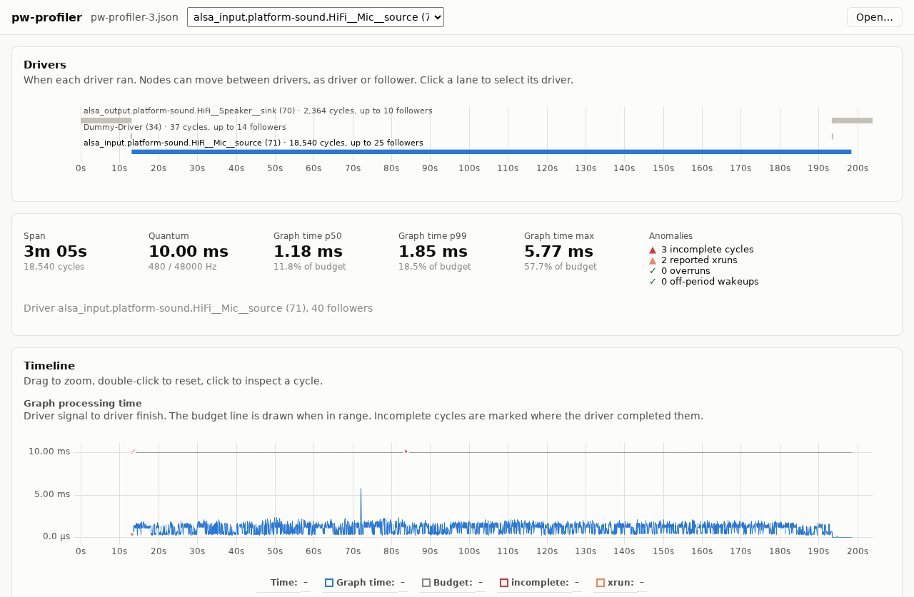
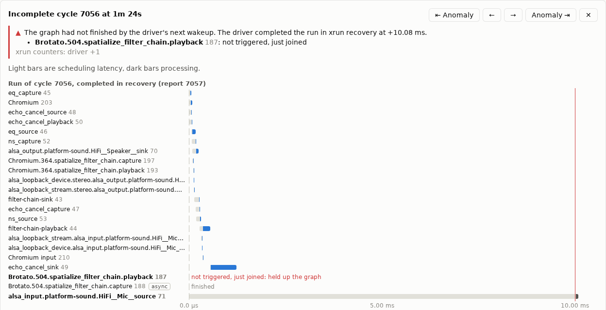

# pw-profiler UI

Browser viewer for `pw-profiler --json` captures.

**https://ford-prefect.github.io/pw-profiler-ui/**

```
pw-profiler -J > profile.json
```

Open the file in the viewer; it is processed locally and not uploaded.



Selecting an incomplete cycle (a graph xrun) shows the node that held it
up:



## Development

```
npm install
npm run dev
npm test
npm run build   # static site in dist/
```

## Layout

Dependencies point one way: `parse → model → analysis → view`.

- `src/parse/`: streaming, line-based reader of the JSON records
- `src/model/`: immutable columnar profile; storage is private behind
  `series()`, `nodeSeries()` and `cycle()`
- `src/analysis/`: pure functions of the model: timings, statistics,
  anomalies
- `src/view/`: Preact UI, signals for state, uPlot for charts
- `src/worker.ts`: runs parse and model building off the main thread

## Deployment

CI builds and tests every push and pull request; pushes to `main` deploy
`dist/` to GitHub Pages (Settings → Pages → Source: GitHub Actions).
